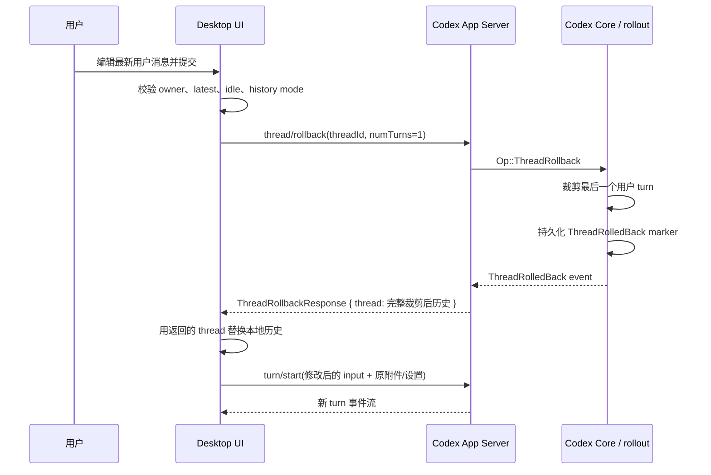

# Codex Desktop 编辑最后一条用户消息实现调研

> 调研日期：2026-08-03
> 范围：官方 Codex Desktop、官方 Codex App Server/CLI、`codex-app-plus`、`codexapp-windows-rebuild`，以及 Paseo 当前可复用链路
> 结论状态：源码与本机发布包静态分析已完成；本报告不包含功能实现

## 摘要

官方 Codex Desktop 当前并没有“修改既有 turn”的原子 API。它在会话空闲且目标是最新 turn 时顺序执行两次 RPC：

1. 对原 thread 调用 `thread/rollback({ numTurns: 1 })`；
2. 用修改后的输入调用 `turn/start`。

`thread/rollback` 返回裁剪后的完整 `Thread`，Desktop 用它替换本地历史，再启动替代 turn。thread ID 不变，所以视觉上像“覆盖最后一次回答”。实际语义是“删除最新用户 turn 及其回答，再在同一 thread 上重跑”。

这个实现有三个必须正视的边界：

- rollback 只裁剪模型历史，不撤销 Agent 已写入工作区的文件；
- rollback 与 `turn/start` 是两个顺序请求，不是事务，第二步失败时 thread 已被回退；
- 官方已将 `thread/rollback` 标为 deprecated，并明确写明“will be removed soon”。

Paseo 已具备大部分短期基础：`agent.rewind`、Codex fork + rollback、强制重灌 provider history、新 timeline epoch 替换、回填 composer 和现有发送链路。短期可以复用这些模块，但不能把 `supportsRewindConversation` 直接当作“可安全编辑最后消息”的能力。建议新增语义明确的 capability 和会话级编排，并在服务端再次验证“最新 canonical 用户消息 + idle”。中期应贯穿 Codex turn ID 和完整可重放输入，迁移到 `thread/fork.beforeTurnId`，彻底去掉 deprecated rollback。

## 研究对象与可复现基线

| 对象                       | 固定版本                                                                                                             | 用途                                     |
| -------------------------- | -------------------------------------------------------------------------------------------------------------------- | ---------------------------------------- |
| 官方 Codex Windows MSIX    | `OpenAI.Codex_26.727.6591.0_x64__2p2nqsd0c76g0`                                                                      | 直接分析实际 Desktop UI 编排             |
| MSIX 内 Electron package   | `26.727.51351`，build `6119`，Electron `42.3.0`                                                                      | 确认渲染包版本                           |
| `app.asar`                 | SHA-256 `670a43ea0dcf6d2583f77272354cf076d1a2d5d9949873c4923c9534d86ea298`                                           | 锁定闭源包内容                           |
| Desktop 主 bundle          | `webview/assets/app-initial-cpPdPura.js`，SHA-256 `69fc795132856b60ba2201695ebb4ac922790a9c341630f9f4f9461bf38ff6d6` | 定位 UI、编辑与 RPC 代码                 |
| 官方 `openai/codex`        | commit [`bb5054f`][official-commit]                                                                                  | 核对 App Server 协议与 rollback 内部语义 |
| `codex-app-plus`           | commit [`81661f6`][plus-commit]                                                                                      | 对照开源第三方实现                       |
| `codexapp-windows-rebuild` | commit [`50c20be`][rebuild-commit]                                                                                   | 对照官方包拆解方法和项目状态             |

官方 Desktop 未公开对应前端源码，以下 Desktop 结论来自上述固定哈希 bundle。关键符号及字符偏移为：`FPt` 1,803,127、`tsl` 12,106,268、`rsl` 12,109,182、`IQu` 14,727,765、`RQu` 14,728,661、`zQu` 14,730,155。符号名是构建产物中的压缩名，不应作为长期接口依赖。

## 官方 Desktop 的实际实现

### 交互门禁

Desktop 只把编辑 handler 传给最新 turn；只读会话、缺少 turn ID 或 `inProgress` turn 不提供编辑。用户可以点击编辑操作，也可以双击用户消息气泡进入内联编辑器。提交期间编辑器进入 loading，提供 Cancel/Send 两个操作。

提交函数 `RQu` 还会再次检查：

- 当前窗口必须是该 thread 的 owner；follower 会先把编辑请求转交 owner；
- 等待未完成的 thread settings 更新；
- 当前历史模式必须支持编辑；
- 被编辑 turn 必须仍是最新 turn；
- 最新 turn 不能是 `inProgress`。

因此 UI 隐藏操作不是唯一保护，提交时仍有防陈旧校验。这一点对 Paseo 很重要：latest/idle 不能只在 React 组件里判断。

### 调用时序



`RQu` 的核心行为可还原为以下伪代码：

```ts
assertOwnerOrForwardToOwner();
await waitForPendingThreadSettingsUpdate();

const latest = getLatestTurn(conversation);
assert(latest.turnId === editedTurn.turnId);
assert(latest.status !== "inProgress");

const rollback = await rpc("thread/rollback", {
  threadId: conversationId,
  numTurns: 1,
});
replaceConversationHistory(rollback.thread);

await startTurn({
  input: replaceFirstTextInput(editedTurn.params.input, editedText),
  cwd: rollback.thread.cwd ?? conversation.cwd,
  attachments: editedTurn.params.attachments,
  commentAttachments: editedTurn.params.commentAttachments,
  serviceTier,
  permissions: resolveCurrentPermissions(),
});
```

### 为什么附件和上下文不会被简单丢掉

`zQu` 不重新拼一个纯文本 prompt，而是复制原 `turn.params.input`，只替换第一个 `type === "text"` 的 item。`FPt` 会保留原文本中最后一个内部上下文分隔符之前的前缀，只替换真正的用户 prompt；其他 input items 原样保留。替换后的首个文本 item 会清空 `text_elements`。

此外，`RQu` 显式转发原 turn 的 `attachments` 和 `commentAttachments`，沿用 rollback thread 或会话的 `cwd`，转发 service tier，并按当前 agent mode/cwd 重新解析权限，同时沿用 active permission profile。它保留的是“可重放的原 turn 参数结构”，而不是只从渲染后的消息文本反推输入。

### “覆盖”不是事务

`thread/rollback` 成功后，Desktop 立即用返回的 Thread 替换本地历史，之后才 await `turn/start`。这两步之间没有事务 ID、幂等键或补偿操作。若 `turn/start` 失败：

- 原最新 turn 已从当前 thread 历史中移除；
- 原回答已在 UI 中消失；
- `RQu` 本身没有把旧 turn 恢复回来的逻辑。

外围编辑器是否保留用户草稿属于 UI 错误处理，不能改变 provider thread 已经回退的事实。Paseo 如果复制这个流程，应把“已回退但替代 turn 未启动”设计成明确、可恢复的状态，而不是假设两次 RPC 一定连续成功。

## `thread/rollback` 的内部语义

### 协议与门禁

官方协议将 `ThreadRollbackParams` 定义为 `threadId + numTurns`，并明确说明它只修改 thread history、不回滚本地文件。[协议源码][official-rollback-schema]

App Server/Core 还会拒绝以下情况：

- `numTurns === 0`；
- paginated history；
- 同一 thread 已有 rollback 在进行；
- 当前仍有 active turn；
- thread 没有可持久化的历史。

这些约束分别可在 [App Server 请求处理][official-rollback-processor] 和 [Core rollback handler][official-rollback-handler] 中核对。

### 裁剪、持久化与响应

Core 不是按 UI item 数量删除，而是定位最后 N 个 instruction/user turn 边界，保留首个用户 turn 之前的系统/开发者上下文，再替换内存 history。[history 裁剪实现][official-history-truncate]

随后 Core 把 `ThreadRolledBack { num_turns }` 写入 rollout。恢复会话时，rollout reconstruction 重放这个 marker，再次调用同样的历史裁剪逻辑，因此 rollback 能跨进程持久化。[marker 写入][official-rollback-handler] [marker 重放][official-rollback-reconstruction]

App Server 收到完成事件后从持久化 thread 重建 `turns`，返回完整 `ThreadRollbackResponse`。这就是 Desktop 能整体替换前端历史、且保持同一 thread ID 的原因。[响应重建][official-rollback-response]

返回的 ThreadItems 仍是有损投影，官方协议注明 command execution 等交互不会全部持久化，因此 rollback 响应不能被视为原始 turn 输入的完整备份。[响应协议][official-rollback-schema]

### 已废弃及迁移接口

`thread/rollback` 已明确标记为 deprecated；除 Codex TUI 外的客户端调用时还会收到 deprecation notice。[废弃通知][official-rollback-deprecation] 官方文档也写明它“is deprecated and will be removed”。[官方 App Server 文档][official-app-server-doc]

当前 `thread/fork` 提供两个更合适的边界参数：[协议源码][official-fork-schema]

- `lastTurnId`：包含该 turn，丢弃其后的 turn；
- `beforeTurnId`：排除该 turn 及之后所有 turn，不能与 `lastTurnId` 同用，目前标记为 experimental。

二者都会创建新 thread ID。对“替换目标 turn”而言，`beforeTurnId = targetTurnId` 的语义最直接；随后在新 thread 上 `turn/start` 替代输入。稳定的 `lastTurnId` 也能通过“fork 到目标前一 turn”实现，但需要拿到前一 turn ID，对编辑首个 turn 还需要单独处理空历史边界。官方文档确认 fork 会创建新 thread，并说明 `lastTurnId` 的包含语义。[官方 fork 文档][official-app-server-doc-fork]

## 四种实现/参考的差异

| 实现                       | 历史边界                                                     | thread ID        | 活动 turn                        | 输入保真                                 | 结论                                    |
| -------------------------- | ------------------------------------------------------------ | ---------------- | -------------------------------- | ---------------------------------------- | --------------------------------------- |
| 官方 Desktop 当前实现      | 固定 rollback 最新 1 turn                                    | 不变             | UI 与 Core 都拒绝                | 复用原 turn params，保留附件和上下文前缀 | UX 最接近目标，但依赖 deprecated API    |
| `codex-app-plus`           | 允许编辑任意历史 turn，`numTurns = turns.length - turnIndex` | 不变             | controller 拒绝 streaming/active | 从它自己的消息模型重建文本和附件         | 可参考 UI/测试，不应照搬其 API 选择     |
| 官方 Codex CLI “Esc 两次”  | 从上一消息位置 fork chat                                     | 新 ID/新会话分支 | 文档描述为空闲 composer 操作     | 由 TUI fork 流程处理                     | 是 fork 语义，不等同于 Desktop 原地覆盖 |
| `codexapp-windows-rebuild` | 无该业务实现                                                 | 不适用           | 不适用                           | 不适用                                   | 项目已暂停，价值仅在 MSIX/ASAR 拆解流程 |

### `codex-app-plus`

它的 controller 先拒绝 streaming/active 会话，按目标 turn 在数组中的位置计算 `numTurns`，调用 `thread/rollback`，用响应 Thread 覆盖本地 conversation，再调用 `startTurn`。[controller 实现][plus-controller]

其测试明确覆盖编辑 `turn-2`/共三个 turn 时发送 `numTurns: 2`，随后 `turn/start` 携带替代文本和 mention attachment。[controller 测试][plus-controller-test] UI 组件允许普通用户消息进入内联 textarea，并在提交时保留原 message 对象及附件。[消息组件][plus-message] [消息测试][plus-message-test]

与官方 Desktop 不同，它不是只开放最新消息，而是允许编辑任意历史 turn。其 README 显示 bundled Codex 基线为 `0.129.0`。[版本说明][plus-readme] 因而它同样承担 rollback 废弃风险，不能作为长期协议依据。

### `codexapp-windows-rebuild`

该仓库 README 已声明官方 Windows 版发布后项目暂停。[项目状态][rebuild-readme] 仓库没有可复用的“编辑最后消息”业务链路；`deconstruct-official-codex.mjs` 的价值在于复制 MSIX、提取 `app.asar`、记录元数据并拆出 webview/runtime 资源，[拆包脚本][rebuild-script] 本次官方包分析方法也与此相符。

### CLI 不能与 Desktop 混为一谈

官方 CLI 文档的原文是：“Press Esc twice with an empty composer to edit the previous user message and fork the chat from that point.”[CLI 文档][official-cli-doc] 关键词是 `fork the chat`。它可以提供交互参考，但不能用来证明 Desktop 的 same-thread rollback 语义。

## Paseo 当前基础

### 已可复用

1. **能力与 RPC 已存在。** 协议已有 `supportsRewindConversation` 和 `agent.rewind.request/response`。[capability schema](../packages/protocol/src/messages.ts#L277) [rewind RPC](../packages/protocol/src/messages.ts#L1483)
2. **Codex provider 已支持 conversation rewind。** 当前能力声明为 true；实现先 fork 整个源 thread，再 rollback 目标及之后的用户 turns，最后切换到 forked thread ID。源 thread 仍保留，降低误回退的不可恢复风险。[Codex capability](../packages/server/src/server/agent/providers/codex-app-server-agent.ts#L202) [Codex rewind](../packages/server/src/server/agent/providers/codex/rewind.ts#L43)
3. **已有统一的 provider capability 调用层。** `invokeRewindCapability` 会按 mode 调用 provider 的 `revertConversation`。[rewind dispatcher](../packages/server/src/server/agent/rewind/rewind.ts#L12)
4. **已有完整历史重灌。** `AgentManager.rewind` 在 conversation rewind 后强制读取 provider history；force hydrate 会删除旧 timeline、初始化新 epoch，再广播新历史。[manager rewind](../packages/server/src/server/agent/agent-manager.ts#L2382) [force hydrate](../packages/server/src/server/agent/agent-manager.ts#L3172)
5. **App 已理解 epoch 替换。** 新 epoch 的 `seq === 1` 会设置 `resetLiveTimeline`，应用事件时清空旧 head/tail。[timeline reducer](../packages/app/src/timeline/session-stream-reducers.ts#L1187)
6. **已有回填 composer 的 UX。** conversation/both rewind 成功后，在 composer 为空时把被回退消息文本恢复进去。[rewind mutation](../packages/app/src/components/rewind/use-rewind-agent-mutation.ts#L25) [composer restore](../packages/app/src/components/rewind/composer-restore.tsx#L23)

这些基础意味着短期实现不需要另建一套历史替换系统。

### 语义与数据缺口

1. **rewind capability 过宽。** `supportsRewindConversation` 只表示 provider 能回退历史，不表示它支持“只编辑最新消息、保留原输入并安全重发”。两者必须分开建模。
2. **当前 UI 对任意用户消息提供 rewind。** `UserMessage` 只要有 capabilities 就渲染 `RewindMenu`，没有 latest/idle gate。[当前消息 UI](../packages/app/src/components/message.tsx#L430)
3. **当前 rewind 会取消运行中的 turn。** `AgentManager.rewind` 检测到 in-flight run 后主动 cancel；目标功能应在非 idle 时隐藏并拒绝，而不是把“编辑”变成隐式中断。[manager rewind](../packages/server/src/server/agent/agent-manager.ts#L2382)
4. **Codex turn ID 没有贯穿 timeline。** Codex history mapper 遍历 `thread.turns`，但投影出的 `user_message` 只保留文本和 item/message ID，没有保存外层 turn ID。[history mapper](../packages/server/src/server/agent/providers/codex-app-server-agent.ts#L1572) [turn projection](../packages/server/src/server/agent/providers/codex-app-server-agent.ts#L1892)
5. **持久化 user message 不是完整可重放输入。** `AgentTimelineItem.user_message` 只有 `text`、`messageId`、`clientMessageId`；历史 mapper 也只从 Codex content 提取文字。[timeline type](../packages/protocol/src/agent-types.ts#L342) 因而 Paseo 不能仅靠重灌后的 timeline 恢复原始图片、结构化 input、comment attachments 或原 turn 参数。
6. **typed fork params 落后于当前官方协议。** Paseo 的 `CodexThreadForkParams` 尚无 `lastTurnId`/`beforeTurnId`，尽管 App Server initialize 已开启 `experimentalApi: true`。[当前 fork 类型](../packages/server/src/server/agent/providers/codex/app-server-transport.ts#L39) [initialize capability](../packages/server/src/server/agent/providers/codex-app-server-agent.ts#L3102)
7. **现有“分叉消息”不是 provider fork。** Assistant fork 当前生成 `chat_history` attachment 并创建新 Paseo draft/workspace；它是上下文复制 UX，不能承载 provider thread 边界语义。[当前 fork context](../packages/app/src/agent-stream/view.tsx#L350)

## Paseo 推荐方案

### 短期：复用现有 rewind，但增加独立语义

建议把兼容性 gate 和 provider 能力分成两层：客户端只通过 `server_info.features.*` 中的新 feature 判断 daemon 是否实现该操作；通过 gate 后，再读取 agent 级 `supportsEditLastUserMessage`（最终命名以协议约定为准）判断当前 provider 是否支持。不能让 UI 根据 `supportsRewindConversation` 猜测。provider 能力至少应保证：

- 只接受当前 timeline 最新 canonical 用户消息；
- 会话必须 idle，不能自动取消 active turn；
- provider 能在回退后通过现有发送链路启动替代 turn；
- UI 和 daemon 都做 latest/idle 校验，daemon 是最终权威；
- 明确告知用户文件改动不会随回答一起撤销。

编排应放在会话/daemon 单点，而不是由 App 分别调用 `agent.rewind` 和 send。新增 RPC 还应遵循项目的点分 request/response 命名规则。单点串行化不能把两个 provider 请求变成真正事务，但可以复用现有 run lock、避免两个客户端在回退与重发之间插入新 turn，并统一处理下面的状态：

| 阶段                          | 失败处理                                                                |
| ----------------------------- | ----------------------------------------------------------------------- |
| 校验前                        | 不改变历史，保留编辑草稿                                                |
| fork/rewind 失败              | 保持原 timeline，编辑器显示错误                                         |
| timeline 重灌失败             | 不自动发送；允许重新同步，避免基于陈旧历史重发                          |
| replacement `turn/start` 失败 | 保留编辑草稿，明确标记“已回退、尚未发送”，允许在当前 forked thread 重试 |
| replacement 启动成功          | 退出编辑态，按正常 turn 流处理                                          |

Paseo 当前 Codex rewind 会先 fork，因此即使后续 rollback/start 失败，原 provider thread 仍在磁盘上。这比官方 Desktop 直接原地 rollback 更容易补偿；需要把原/forked thread ID 和失败阶段记录在一次操作上下文中，不能只依赖 UI toast。

短期最小 UI 边界：

- 只在最新 canonical 用户消息的 hover/action 区显示编辑按钮；
- idle 时才可进入和提交编辑；
- 气泡内联 editor 预填原文本，Cancel 不改变历史；
- 提交期间锁定同一操作，保留原附件的只读预览；
- 不把 assistant fork 菜单或普通 rewind 菜单改名后复用为编辑。

如果短期无法持久化完整 input，能力只能对“可证明为纯文本、无不可重建附件”的消息开放；静默丢附件不可接受。

### 中期：迁移到 turn-boundary fork

推荐按以下顺序迁移：

1. 在 provider history projection、Paseo timeline/wire schema 和 UI stream item 中贯穿 `providerTurnId`；新增字段必须可选，保持旧 daemon/client 双向兼容。
2. 为可编辑用户 turn 保存完整、经过版本化的 replay input，至少覆盖文本 input items、图片/本地图片、attachments、comment attachments、cwd、协作/权限相关设置和 service tier；敏感或失效引用必须有显式错误。
3. 扩充 `CodexThreadForkParams` 的 typed schema，支持官方的 `lastTurnId` 和实验性 `beforeTurnId`，并做互斥校验。
4. 对目标 turn 调用 `thread/fork({ beforeTurnId: targetTurnId })`，切换 Paseo session 到返回的新 thread ID，再启动替代 turn。
5. 通过现有 force hydrate/new epoch 机制替换 timeline，确认 session persistence、恢复和多客户端同步都使用新 ID。
6. 移除编辑链路对 `thread/rollback` 的依赖；普通 rewind 是否继续支持应单独决策，不能阻塞编辑迁移。

这一方案改变 provider thread ID，但 Paseo 当前 Codex rewind 本来就会先 fork 并切换 ID，因此主要工作不是接受新 ID，而是把精确 turn boundary 和可重放输入变成一等数据。

## 建议验收行为

后续实现任务至少应覆盖：

- idle + 最新纯文本消息：旧回答消失，修改后的消息只发送一次，新回答进入新 epoch；
- 非最新消息、assistant 消息、synthetic/system 消息：无编辑入口，服务端直接请求也被拒绝；
- turn 运行中或刚从 idle 变 active：提交被拒绝，不触发 cancel；
- 原消息包含图片、mention、文件或 comment attachment：全部保持，或能力明确不可用；
- rollback/fork 成功但 `turn/start` 失败：草稿仍可见，状态可恢复，不误显示旧回答仍在当前分支；
- 多客户端同时提交：只有一个操作获得 run lock，另一个得到陈旧/冲突错误；
- App 重连和 daemon 重启：新 provider thread ID、timeline epoch 和编辑结果一致；
- 文件已被原回答修改：编辑操作不宣称或暗示这些文件已还原。

## 已确认事实、工程判断与未知项

### 已确认事实

- 官方 Desktop 固定执行 `thread/rollback(numTurns: 1)` 后 `turn/start`，同一 thread ID；
- Desktop 只允许 latest + idle turn，并在提交函数再次检查；
- Desktop 基于原 turn params 替换首个文本 input，保留其余 input 和附件字段；
- rollback 通过 rollout marker 持久化，只裁剪模型历史，不回滚文件；
- rollback 已 deprecated，paginated/active/concurrent rollback 会被拒绝；
- `codex-app-plus` 使用 rollback N turns 支持任意历史 turn；
- Paseo 已有 fork + rollback + timeline epoch 重灌，但缺少 provider turn ID 和完整 replay input。

### 工程判断

- Paseo 应新增 `server_info.features.*` 兼容 gate、编辑专用 provider capability 和 daemon 级串行化编排边界；
- 短期可以复用现有 rewind/timeline/send 模块，但不应直接复用现有菜单语义；
- 中期应选择 `thread/fork.beforeTurnId`，用新 thread ID 换取明确、未废弃的历史边界；
- 在完整 input 尚不可重放时，应限制能力范围，而不是降级为仅文本重发。

### 尚未确认

- OpenAI 移除 `thread/rollback` 的具体版本和日期，官方只写了“will be removed soon”；
- `thread/fork.beforeTurnId` 何时转为稳定 API；
- Desktop 后续版本是否已经计划从 same-thread rollback 迁移到 fork；
- Desktop 外围错误边界在 `turn/start` 失败后是否始终保留编辑草稿；静态分析只能确认 `RQu` 内没有补偿操作。

## 来源

[official-commit]: https://github.com/openai/codex/tree/bb5054fe47abe73ecbbd454751066a28c89f4bb9
[official-fork-schema]: https://github.com/openai/codex/blob/bb5054fe47abe73ecbbd454751066a28c89f4bb9/codex-rs/app-server-protocol/src/protocol/v2/thread.rs#L509-L523
[official-rollback-schema]: https://github.com/openai/codex/blob/bb5054fe47abe73ecbbd454751066a28c89f4bb9/codex-rs/app-server-protocol/src/protocol/v2/thread.rs#L1097-L1116
[official-rollback-deprecation]: https://github.com/openai/codex/blob/bb5054fe47abe73ecbbd454751066a28c89f4bb9/codex-rs/app-server/src/request_processors/thread_processor.rs#L708-L730
[official-rollback-processor]: https://github.com/openai/codex/blob/bb5054fe47abe73ecbbd454751066a28c89f4bb9/codex-rs/app-server/src/request_processors/thread_processor.rs#L1815-L1862
[official-rollback-handler]: https://github.com/openai/codex/blob/bb5054fe47abe73ecbbd454751066a28c89f4bb9/codex-rs/core/src/session/handlers.rs#L462-L564
[official-history-truncate]: https://github.com/openai/codex/blob/bb5054fe47abe73ecbbd454751066a28c89f4bb9/codex-rs/core/src/context_manager/history.rs#L210-L249
[official-rollback-reconstruction]: https://github.com/openai/codex/blob/bb5054fe47abe73ecbbd454751066a28c89f4bb9/codex-rs/core/src/session/rollout_reconstruction.rs#L365-L367
[official-rollback-response]: https://github.com/openai/codex/blob/bb5054fe47abe73ecbbd454751066a28c89f4bb9/codex-rs/app-server/src/bespoke_event_handling.rs#L1534-L1552
[official-app-server-doc]: https://learn.chatgpt.com/docs/app-server.md#roll-back-recent-turns
[official-app-server-doc-fork]: https://learn.chatgpt.com/docs/app-server.md#start-or-resume-a-thread
[official-cli-doc]: https://learn.chatgpt.com/docs/developer-commands.md?surface=cli#interactive-shortcuts
[plus-commit]: https://github.com/fraternity-z/codex-app-plus/tree/81661f641ae22b74f1a97aa63c608c02f8055337
[plus-controller]: https://github.com/fraternity-z/codex-app-plus/blob/81661f641ae22b74f1a97aa63c608c02f8055337/src/features/conversation/hooks/useWorkspaceConversationController.ts#L812-L855
[plus-controller-test]: https://github.com/fraternity-z/codex-app-plus/blob/81661f641ae22b74f1a97aa63c608c02f8055337/src/features/conversation/hooks/useWorkspaceConversation.test.tsx#L854-L906
[plus-message]: https://github.com/fraternity-z/codex-app-plus/blob/81661f641ae22b74f1a97aa63c608c02f8055337/src/features/conversation/ui/HomeChatMessage.tsx#L17-L70
[plus-message-test]: https://github.com/fraternity-z/codex-app-plus/blob/81661f641ae22b74f1a97aa63c608c02f8055337/src/features/conversation/ui/HomeChatMessage.test.tsx#L263-L285
[plus-readme]: https://github.com/fraternity-z/codex-app-plus/blob/81661f641ae22b74f1a97aa63c608c02f8055337/README.md#L58-L59
[rebuild-commit]: https://github.com/fraternity-z/codexapp-windows-rebuild/tree/50c20befa2f95577893e7bda002113e51402634a
[rebuild-readme]: https://github.com/fraternity-z/codexapp-windows-rebuild/blob/50c20befa2f95577893e7bda002113e51402634a/README.md#L1-L5
[rebuild-script]: https://github.com/fraternity-z/codexapp-windows-rebuild/blob/50c20befa2f95577893e7bda002113e51402634a/scripts/deconstruct-official-codex.mjs#L737-L750
