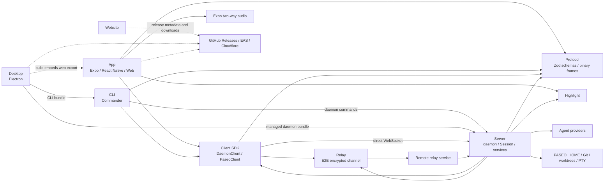
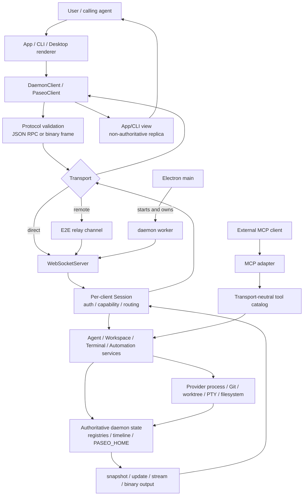
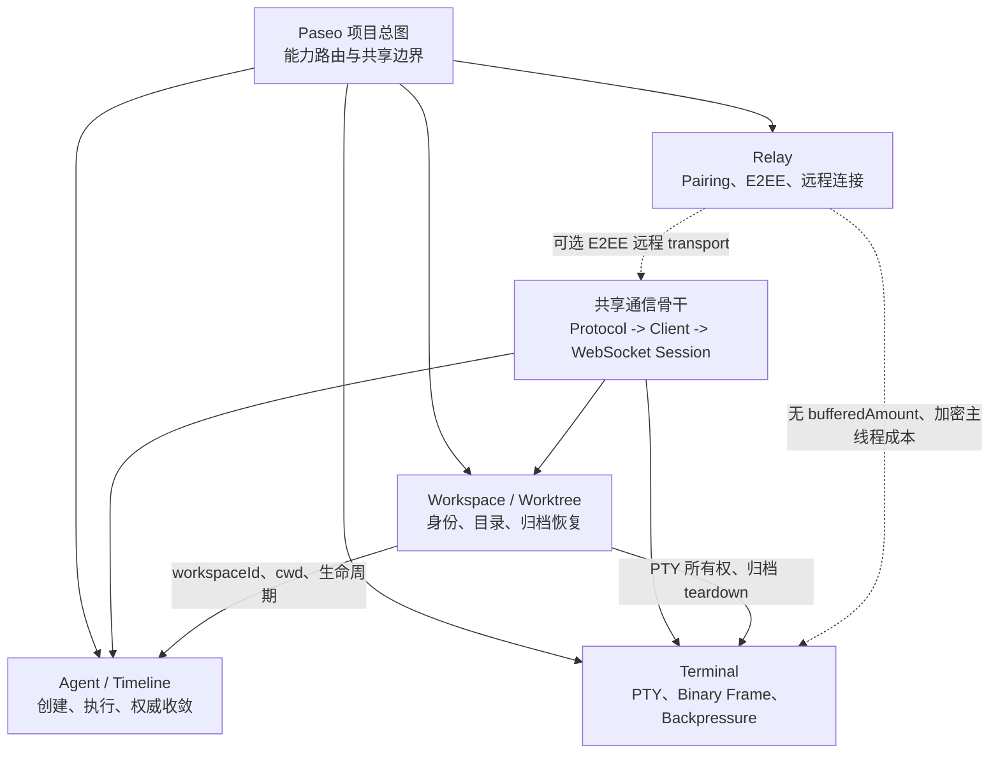

# Paseo Reforged CodeMap (project)

> Agent-facing terrain index. Source and tests win when this map drifts.
>
> Updated `2026-07-30`: refreshed after the project ruleset migration and added the requested total context, project map, and core runtime flow.

## 1. 总 Context（Orientation）

- Project: `paseo` / Paseo Reforged
- Role / responsibility: 在本地 daemon 上创建、监控和控制 AI coding agents，并通过 App、CLI、Desktop 或加密 relay 远程交互。
- Main languages / frameworks: TypeScript、Node.js、React Native + Expo、Electron、Commander；wire schema 使用 Zod。
- Runtime / deployment shape: 本地 daemon、Electron 托管 daemon、可选 E2E relay；App 支持 iOS/Android/browser/Electron renderer。
- Primary entry types: WebSocket session RPC、App routes/composer、CLI commands、MCP tool catalog、Desktop main process。
- Confidence:
  - confirmed: workspace 包边界、核心入口、WebSocket/agent/workspace 主流程、文件持久化和验证命令均已由源码与仓库文档复核。
  - inferred: package 依赖方向以 manifests、build scripts 和 import 边界归纳；变更前仍应读取目标 package manifest。
  - unknown: Hub、浏览器自动化和 voice 的完整运行链未在本次总图中深挖；relay 的实际生产部署拓扑仍需外部确认。

### 首屏路由

| 要判断的事       | 当前总 Context                                                                                                     | 下一份事实源                                                                                                                                                         |
| ---------------- | ------------------------------------------------------------------------------------------------------------------ | -------------------------------------------------------------------------------------------------------------------------------------------------------------------- |
| 产品是什么       | self-hosted、local-first、多端 Agent orchestration UI；daemon 持有运行中 Agent，客户端只连接和呈现                 | [`docs/product.md`](../../docs/product.md)、[`docs/architecture.md`](../../docs/architecture.md)                                                                     |
| 从哪里进入       | App、CLI、Desktop、MCP 最终汇入 daemon；远程客户端可经 relay 接入同一 WebSocket/session 边界                       | `Entry Index`、`Cross-Module Flows`                                                                                                                                  |
| 合同在哪里       | `packages/protocol` 定义 wire schema/frames；`packages/client` 提供 low-level driver 与 SDK facade                 | [`packages/protocol/src/messages.ts`](../../packages/protocol/src/messages.ts)、[`packages/client/src/daemon-client.ts`](../../packages/client/src/daemon-client.ts) |
| 行为由谁拥有     | daemon 的 Session 和领域服务拥有 mutation truth；App cache/store 只是非权威 display replica                        | `Domain And Data`、目标 Feature CodeMap                                                                                                                              |
| 数据落在哪里     | daemon 状态主要位于 `$PASEO_HOME`，项目/工作区还落到 Git、worktree 和文件系统；客户端另有 AsyncStorage/IndexedDB   | [`docs/data-model.md`](../../docs/data-model.md)                                                                                                                     |
| 改动前读什么     | 当前行为看源码、测试和日志；系统约束看 `docs/`；项目路由和门禁看 `AGENTS.md`/`PROJECT.md`；目标行为看唯一活跃 Spec | [`PROJECT.md`](../../PROJECT.md)、[`AGENTS.md`](../../AGENTS.md)                                                                                                     |
| 如何验证         | 文档做路径/链接/格式检查；代码做受影响单测、`typecheck`、`lint`；本地禁止跑全量测试，开发 daemon 默认使用 `6768`   | [`docs/testing.md`](../../docs/testing.md)、[`docs/development.md`](../../docs/development.md)                                                                       |
| CodeMap 如何使用 | 本图只负责路由；命中具体能力后只加载一张 Feature Map，再回到源码/测试取证                                          | `Capability Index`、`Progressive Reading Order`                                                                                                                      |

## 2. Context Tree

```text
Node: Paseo
  -> Node: Capability Index
  -> Node: Module Index
  -> Node: Entry Index
  -> Node: Domain And Data
  -> Node: External Dependencies
  -> Node: Cross-Module Flows
  -> Node: Validation
  -> Node: Risk Areas
  -> Node: Feature CodeMap Backlog
```

### 项目总图



- Solid edges: runtime or declared workspace dependency confirmed by manifests/source.
- Dashed edges: build, distribution, or deployment relationship; not a normal daemon request path.
- Next Drill-Down: runtime behavior follows `项目核心运行流程图`; packaging/release behavior follows the brand/release Feature Map.

### Node: Paseo

- Type: `project`
- Status: `confirmed`
- Purpose: 先定位 package、入口和行为真相源，再加载具体 Feature CodeMap 或源码。
- Read First:
  - [`docs/product.md`](../../docs/product.md): 产品边界与核心对象。
  - [`docs/architecture.md`](../../docs/architecture.md): 包责任、协议、部署和主数据流。
  - [`package.json`](../../package.json): workspace、build 顺序和根命令。
  - [`PROJECT.md`](../../PROJECT.md): 项目事实、工作流参数、专有规则与私有 Skill 路由。
  - [`AGENTS.md`](../../AGENTS.md): 当前项目协作、授权和执行门禁。
- Edges / Children:
  - `Capability Index`: 按用户能力选地图。
  - `Module Index`: 按代码所有权选 package。
  - `Entry Index`: 从 UI/CLI/RPC/MCP 入口进入调用链。
  - `Domain And Data`: 先区分 Agent、Project、Workspace、Timeline 和 runtime-only state。
  - `Cross-Module Flows`: 只保留跨 package 主干；细节下钻 Feature Map。
- Evidence: 上述文档、根 workspace manifest 和 package 主入口。
- Unknowns: 非核心 package 的所有内部模块未枚举。
- Next Drill-Down: 先选 Capability，再读其 `Read First`；不要顺序加载整个仓库。

### Node: Capability Index

- Type: `capability`
- Status: `confirmed`
- Purpose: 将需求路由到最短的源码链。
- Children:
  - Agent 创建、运行、权限、Timeline 同步:
    - Main modules: `app -> client/protocol -> server/session -> AgentManager -> provider`
    - Entry: `DaemonClient.createAgent()`、MCP `create_agent`、CLI `runRunCommand()`
    - Feature CodeMap: [`Agent 创建、执行与 Timeline 同步`](2026-07-20_01-47_Agent创建执行与Timeline同步功能.md)
    - Status: `confirmed`
  - Project/Workspace/Worktree 创建、归档、恢复:
    - Main modules: `app/cli -> client/protocol -> session -> provisioning/archive/recovery -> registries/git`
    - Entry: `DaemonClient.openProject()` / `createWorkspace()` / `archiveWorkspace()`
    - Feature CodeMap: [`Workspace、Worktree 与归档恢复`](2026-07-20_01-47_Workspace-Worktree与归档恢复功能.md)
    - Status: `confirmed`
  - Terminal、Binary Frame 与 Backpressure:
    - Main modules: `app -> client/protocol -> server terminal worker/PTY`
    - Entry: `DaemonClient.subscribeTerminal()`、terminal binary input/resize frames
    - Feature CodeMap: [`Terminal、Binary Frame 与 Backpressure`](2026-07-20_09-20_Terminal-Binary-Frame与Backpressure功能.md)
    - Status: `confirmed`
  - Files、checkout、forge:
    - Main modules: `app/client/protocol/server`
    - Entry: session RPC 与 file-transfer binary frames
    - Feature CodeMap: pending
    - Status: `confirmed`（仅地形）
  - Remote relay / pairing:
    - Main modules: `relay/server/client/app`
    - Entry: relay channel constructors、daemon outbound transport
    - Feature CodeMap: [`Relay 配对、E2E 加密与远程连接`](2026-07-20_09-20_Relay配对E2E加密与远程连接功能.md)
    - Status: `confirmed`
  - Schedule、Loop、Chat、Heartbeat:
    - Main modules: `server/cli/app/protocol`
    - Entry: CLI commands 与 session RPC
    - Feature CodeMap: pending
    - Status: `confirmed`（仅边界）
  - Voice / two-way audio:
    - Main modules: `app/server/expo-two-way-audio/protocol`
    - Entry: dictation/assistant stream messages
    - Feature CodeMap: pending
    - Status: `confirmed`（仅边界）
  - Desktop wrapper / in-app browser:
    - Main modules: `desktop/app`
    - Entry: [`packages/desktop/src/main.ts`](../../packages/desktop/src/main.ts)
    - Feature CodeMap: pending
    - Status: `confirmed`（仅边界）
  - Brand identity / packaging / release:
    - Main modules: root scripts/workflows、`app/desktop/website`
    - Entry: root `release:*` scripts、platform manifests、GitHub release workflows
    - Feature CodeMap: [`品牌身份与发布链路`](2026-07-22_00-12_品牌身份与发布链路功能.md)
    - Status: `confirmed`（地形）；该 Feature Map 的 rollout 状态早于当前 `v0.2.4-beta.1`，发布任务前必须重查源码和远端
- Evidence: [`docs/architecture.md`](../../docs/architecture.md)、package manifests、CLI command registry。
- Unknowns: pending 能力未确认完整分支、错误路径和验证闭环。
- Validation: 进入 pending 能力前先搜索实际入口和相邻测试，不把本表当行为说明。
- Next Drill-Down: 优先使用已有 Feature Map；其余能力按任务需要新建窄图。

### Node: Module Index

- Type: `module`
- Status: `confirmed`
- Purpose: 确定代码所有权和跨包声明构建顺序。

| Module / Package   | Path                                                               | Responsibility                                                      | Key Dependencies                                      | Risk Notes                              |
| ------------------ | ------------------------------------------------------------------ | ------------------------------------------------------------------- | ----------------------------------------------------- | --------------------------------------- |
| Protocol           | [`packages/protocol`](../../packages/protocol)                     | wire schemas、shared types、binary frames、endpoint parsing         | Zod                                                   | append-only 兼容；生成校验              |
| Client             | [`packages/client`](../../packages/client)                         | WebSocket driver、correlated RPC、SDK facade                        | protocol、relay transport                             | reconnect、timeout、能力协商            |
| Server             | [`packages/server`](../../packages/server)                         | daemon、agent/workspace/terminal lifecycle、MCP、storage            | protocol、client、relay、highlight、provider runtimes | 状态机、文件系统、进程和兼容边界集中    |
| App                | [`packages/app`](../../packages/app)                               | Expo UI、host runtime、workspace/agent state、timeline presentation | client、protocol、highlight、React Native             | 跨平台、路由恢复、非权威 client replica |
| CLI                | [`packages/cli`](../../packages/cli)                               | Docker-style commands、daemon lifecycle 和结构化输出                | client、protocol、server、Commander                   | 自动化契约与退出错误                    |
| Relay              | [`packages/relay`](../../packages/relay)                           | E2E encrypted byte relay                                            | protocol/client crypto primitives                     | trust model、key/channel pairing        |
| Desktop            | [`packages/desktop`](../../packages/desktop)                       | Electron wrapper、managed daemon、native/browser bridges            | App web export、server/CLI bundle                     | main/renderer/guest ownership边界       |
| Website            | [`packages/website`](../../packages/website)                       | `paseo.sh` marketing site                                           | TanStack Router、Cloudflare                           | 与产品 runtime 解耦                     |
| Highlight          | [`packages/highlight`](../../packages/highlight)                   | shared syntax highlighting support                                  | parser/highlight dependencies                         | App/server shared build dependency      |
| Expo two-way audio | [`packages/expo-two-way-audio`](../../packages/expo-two-way-audio) | native two-way audio streaming module                               | Expo/native toolchains                                | iOS/Android native build                |

- Evidence: 根 `workspaces`、各 `package.json`、[`docs/architecture.md`](../../docs/architecture.md)。
- Unknowns: 具体改动的 ownership 仍以 import graph 和相邻测试为准。
- Validation: protocol/client 声明变更后按根 scripts 重建 owner stack。
- Next Drill-Down: 先读目标 package manifest，再读表中入口文件。

### Node: Entry Index

- Type: `entry`
- Status: `confirmed`
- Purpose: 从真实输入面进入，不从深层 helper 反推主流程。
- Entries:
  - Daemon process: [`packages/server/src/server/daemon-worker.ts`](../../packages/server/src/server/daemon-worker.ts) -> environment/config/lifecycle；[`bootstrap.ts`](../../packages/server/src/server/bootstrap.ts) -> HTTP/WS、registries、AgentManager、relay、services 装配。
  - WebSocket boundary: [`packages/server/src/server/websocket-server.ts`](../../packages/server/src/server/websocket-server.ts) -> hello、连接、binary/text frames；[`session.ts`](../../packages/server/src/server/session.ts) -> per-client RPC 和订阅。
  - Wire contract: [`packages/protocol/src/messages.ts`](../../packages/protocol/src/messages.ts) -> inbound/outbound discriminated unions 与 feature flags。
  - Client API: [`packages/client/src/daemon-client.ts`](../../packages/client/src/daemon-client.ts) -> low-level RPC；[`packages/client/src/index.ts`](../../packages/client/src/index.ts) -> public facade。
  - App: [`packages/app/index.ts`](../../packages/app/index.ts) -> Expo entry；[`packages/app/src/app`](../../packages/app/src/app) -> routes；[`packages/app/src/composer/index.tsx`](../../packages/app/src/composer/index.tsx) -> prompt surface。
  - CLI: [`packages/cli/src/index.ts`](../../packages/cli/src/index.ts) -> `runCli()`；[`packages/cli/src/cli.ts`](../../packages/cli/src/cli.ts) -> command registry。
  - MCP: [`packages/server/src/server/agent/mcp-server.ts`](../../packages/server/src/server/agent/mcp-server.ts) -> adapter；[`paseo-tools.ts`](../../packages/server/src/server/agent/tools/paseo-tools.ts) -> transport-neutral catalog。
  - Desktop: [`packages/desktop/src/main.ts`](../../packages/desktop/src/main.ts) -> BrowserWindow、managed daemon、IPC。
  - Relay: [`packages/relay/src/index.ts`](../../packages/relay/src/index.ts) -> client/daemon channel exports。
  - Website: [`packages/website/src/routes`](../../packages/website/src/routes) -> public routes；[`packages/website/src/release.ts`](../../packages/website/src/release.ts) -> release/download metadata boundary。
- Evidence: entry manifests、source exports、[`docs/architecture.md`](../../docs/architecture.md)。
- Unknowns: Hub 和 website 的部署入口未展开。
- Validation: 用 `rg` 查实际注册/调用者，再读入口相邻测试。
- Next Drill-Down: UI 行为先选 route/composer；host 行为先选 protocol message -> Session case。

### Node: Domain And Data

- Type: `object`
- Status: `confirmed`
- Purpose: 防止把相似字段当成同一身份或生命周期。
- Children:
  - `Agent`: provider-backed session record；`workspaceId` 是所有权，`cwd` 是执行目录；archive 与 runtime collection 分离。
  - `Project`: exact selected root 的稳定 membership；新 ID 为 opaque `prj_*`。
  - `Workspace`: project 内具体执行目录；ID 为 opaque `wks_*`，placement 由 `cwd/worktreeRoot/mainRepoRoot` 描述。
  - `Timeline`: daemon 维护 `epoch + seq`，live stream 提供即时性，fetch 提供权威 reconciliation。
  - `Terminal`: runtime-only，按 `workspaceId` 归属；I/O 使用 binary frames。
  - `Schedule / Loop / Chat`: daemon 文件存储的独立业务对象。
  - Client state: Zustand/TanStack Query/AsyncStorage display replica；不拥有 daemon mutation truth。
- Read First:
  - [`docs/data-model.md`](../../docs/data-model.md)
  - [`docs/agent-lifecycle.md`](../../docs/agent-lifecycle.md)
  - [`docs/timeline-sync.md`](../../docs/timeline-sync.md)
  - [`packages/server/src/server/workspace-registry.ts`](../../packages/server/src/server/workspace-registry.ts)
- Evidence: schemas、registry models、storage paths和 lifecycle docs。
- Unknowns: 各 store 的原子写细节需在修改对应 store 时复核。
- Validation: identity 变更必须覆盖 same-`cwd` multiple-workspace 和 restart/recovery tests。
- Next Drill-Down: Agent/Timeline 或 Workspace 任务使用对应 Feature Map。

### Node: External Dependencies

- Type: `dependency`
- Status: `confirmed`
- Purpose: 标出 daemon 之外会失败或改变行为的边界。
- Children:
  - Agent providers: Claude Code、Codex、Copilot/ACP、OpenCode、Pi、OMP；各自负责认证和原生 session persistence。
  - Filesystem / process: `$PASEO_HOME` JSON stores、PTY、provider subprocesses、managed desktop daemon。
  - Git / forge: Git CLI、GitHub/其他 forge adapters、worktree filesystem placement。
  - Network: direct WebSocket、optional relay、push/voice/Hub integrations。
  - Platform runtime: Expo native/web、Electron main/renderer/guest、native audio module。
  - Distribution services: GitHub Releases/API、EAS 和 Cloudflare；只在 build/release/website 路径使用，不参与本地 daemon mutation flow。
- Edges / Children:
  - used by: server services and provider adapters。
  - produces: provider stream events、git/workspace metadata、relay frames、native UI events。
  - failure surfaces: unavailable binary/auth、filesystem permissions、disconnect/reconnect、stale workspace placement、platform-specific APIs。
- Evidence: [`docs/architecture.md`](../../docs/architecture.md)、[`SECURITY.md`](../../SECURITY.md)、provider/relay/worktree source。
- Unknowns: 第三方版本/API 语义按具体任务通过 Context7 查询，不在 CodeMap 固化。
- Validation: 使用相邻 unit/e2e；需要真实 provider 时用项目登记的窄集成测试。
- Next Drill-Down: 修改某外部边界时读取其 manifest、adapter、官方当前文档和失败测试。

### Node: Cross-Module Flows

- Type: `flow`
- Status: `confirmed`
- Purpose: 显示 package 间主干、现有 CodeMap 的跨能力依赖和按场景下钻顺序；具体分支留给 Feature Map。

#### 项目核心运行流程图



- Request path: surface -> client/protocol -> transport -> WebSocket/Session -> owning service -> external or persisted effect.
- Convergence path: daemon snapshot/update/stream -> client -> UI/CLI replica; live events provide immediacy, authoritative fetch/reconciliation provides correctness.
- Branches: MCP enters through the tool catalog; Desktop can own the daemon process; relay changes transport but not the Session/domain contract.

| Flow                                    | Modules                                                                    | Entry                                               | Effect                                                                            | Drill-Down                                                                 |
| --------------------------------------- | -------------------------------------------------------------------------- | --------------------------------------------------- | --------------------------------------------------------------------------------- | -------------------------------------------------------------------------- |
| Create/run agent and sync timeline      | app/CLI/MCP -> client/protocol -> session/manager/provider -> app reducers | `create_agent_request`                              | agent record、provider run、live + authoritative timeline                         | [Feature Map](2026-07-20_01-47_Agent创建执行与Timeline同步功能.md)         |
| Create/archive/recover workspace        | app/CLI -> client/protocol -> session/services -> registries/git           | `workspace.create.request` / archive / recovery RPC | registry placement、teardown、optional worktree deletion/recreation               | [Feature Map](2026-07-20_01-47_Workspace-Worktree与归档恢复功能.md)        |
| Stream terminal and handle backpressure | app -> client/protocol -> session/controller -> worker/PTY -> App xterm    | `subscribe_terminal_request` + binary frames        | low-latency output、per-client coalescing、snapshot fallback/replay、input/resize | [Feature Map](2026-07-20_09-20_Terminal-Binary-Frame与Backpressure功能.md) |
| Connect and synchronize host            | app/CLI -> client -> websocket server/session                              | `hello` then `server_info`                          | capabilities、snapshots、subscriptions、RPC routing                               | pending                                                                    |
| Remote access                           | app/client <-> relay <-> daemon transport                                  | pairing offer + relay v2 control/data sockets       | E2EE handshake、opaque WebSocket payload forwarding、normal Paseo session         | [Feature Map](2026-07-20_09-20_Relay配对E2E加密与远程连接功能.md)          |
| Managed desktop                         | Electron main -> daemon subprocess + App renderer                          | `packages/desktop/src/main.ts`                      | local desktop window、IPC、daemon lifecycle                                       | pending                                                                    |
| Build and release identity              | root scripts/workflows -> app/desktop/website                              | root `release:*` scripts and release workflows      | versioned artifacts、updater metadata、download links                             | [Feature Map](2026-07-22_00-12_品牌身份与发布链路功能.md)                  |

#### Cross-Capability Dependencies



- Status: `confirmed`；由四张 Feature Map 的 `Related Capabilities`、共享 protocol/client/session 入口和 `2026-07-20` drift-check 交叉核对。
- Runtime dependency:
  - Workspace 为 Agent 和 Terminal 提供 `workspaceId`、执行目录和 archive/recovery 生命周期边界。
  - Relay 覆盖共享 WebSocket transport，因此可承载 Agent/Timeline、Workspace RPC 和 Terminal binary frames。
  - Terminal 与 Relay 另有压力信号和主线程成本耦合；relay transport 不提供 direct socket 的 `bufferedAmount`。
- Routing-only dependency: Project CodeMap 只负责选图，不参与 runtime 数据流。
- Unknowns: Host connection/reconnect/capability negotiation 尚无专用 Feature Map；Relay 实际生产部署拓扑仍需外部确认。

#### Progressive Reading Order

- Default: 先读本项目总图，再读命中的一张 Feature Map；只有 ownership、transport 或 teardown 跨界时才加载下一张。
- Feature anchors: [`Agent / Timeline`](2026-07-20_01-47_Agent创建执行与Timeline同步功能.md)、[`Workspace / Worktree`](2026-07-20_01-47_Workspace-Worktree与归档恢复功能.md)、[`Terminal / Backpressure`](2026-07-20_09-20_Terminal-Binary-Frame与Backpressure功能.md)、[`Relay / E2EE`](2026-07-20_09-20_Relay配对E2E加密与远程连接功能.md)、[`Brand / Release`](2026-07-22_00-12_品牌身份与发布链路功能.md)。

| Scenario                                   | Reading Order                                      | Load Next Only When                                             |
| ------------------------------------------ | -------------------------------------------------- | --------------------------------------------------------------- |
| 陌生任务或全局定位                         | Project -> matching Feature Map                    | Capability Index 已确认目标链路                                 |
| Agent 创建或 Timeline 收敛                 | Project -> Agent/Timeline -> Workspace             | 涉及 `cwd`、worktree、workspace intent 或 archive               |
| Workspace 创建、归档或恢复                 | Project -> Workspace -> Agent/Timeline or Terminal | 需要核对 agent/terminal 级联 teardown                           |
| Direct Terminal latency/snapshot           | Project -> Terminal -> Workspace                   | 涉及 terminal 归属、共享目录或 archive                          |
| Remote Terminal                            | Project -> Relay -> Terminal -> Workspace          | E2EE/session 已建立后仍存在 stream 问题，或需核对 PTY ownership |
| Pairing、key、handshake 或 relay reconnect | Project -> Relay -> target business map            | 已越过 `e2ee_ready` 和 Paseo `server_info`                      |
| Remote Agent/Timeline                      | Project -> Relay -> Agent/Timeline -> Workspace    | 远程 transport 正常后仍有 timeline/执行目录问题                 |
| 品牌、安装包、更新或发布                   | Project -> Brand/Release                           | 先刷新该 Feature Map 的 rollout 状态，再进入 release gate       |

- Evidence: protocol schemas、session dispatch、package entrypoints。
- Unknowns: pending flows need task-specific branch tracing。
- Validation: use protocol/client/server contract tests plus user-surface e2e for the selected flow。
- Next Drill-Down: follow the scenario table and stop once the selected Feature Map reaches a source/test validation entry。

### Node: Validation

- Type: `validation`
- Status: `confirmed`
- Purpose: 选择最窄、可运行且不冻结机器的证据。
- Validation Entry:
  - Static: `npm run typecheck`、`npm run lint`、`npm run format:check`。
  - Unit/integration: `npx vitest run <single-file> --bail=1`；测试分布在各 package 源码相邻位置及 `packages/cli/tests/`。
  - App e2e: [`packages/app/e2e`](../../packages/app/e2e)，按单个 spec 运行。
  - Local run: `npm run dev:server`、`npm run dev:app`、`npm run dev:desktop`；不得触碰未获准的 `6767` 主 daemon。
  - Logs: checkout-local `$PASEO_HOME/daemon.log`；默认 dev home 为 `.dev/paseo-home`。
  - CI/release: 根 `release:check` 定义发布级 build/typecheck/pack 序列，但本地不得无授权运行宽套件。
- Edges / Children:
  - proves: selected package static contracts and the chosen behavior path。
  - does not prove: 未运行的 platform/provider/relay variants 或生产部署。
- Evidence: [`docs/testing.md`](../../docs/testing.md)、[`docs/development.md`](../../docs/development.md)、root scripts。
- Unknowns: 每个 Feature 的最低成本验证命令由对应 map 与当前 diff 决定。
- Next Drill-Down: 先读相邻测试名，再运行单文件；全套交给 CI。

### Node: Risk Areas

- Type: `risk`
- Status: `confirmed`
- Purpose: 在改动前触发必需文档和专用验证。
- Risks:
  - Protocol compatibility: [`messages.ts`](../../packages/protocol/src/messages.ts)；旧 client/new daemon 双向解析不可破坏。
  - Timeline convergence: [`docs/timeline-sync.md`](../../docs/timeline-sync.md)；live 不是 correctness source，catch-up 必须分页到 `hasNewer=false`。
  - Workspace identity/placement: [`docs/data-model.md`](../../docs/data-model.md)；`workspaceId`、`cwd`、`worktreeRoot`、`mainRepoRoot` 不可混用。
  - Archive/data loss: workspace/agent archive 是不同 lifecycle；worktree 删除只允许 Paseo-owned 且无 active reference。
  - App routing/platform: route restore 和 DOM/native/Electron gates 易造成 native blank screen 或跨平台 crash。
  - Daemon/process safety: 主 `6767` daemon 管理正在运行的 agents，未经允许不得重启。
  - File persistence: JSON schema、atomic write 和兼容默认值变化可能影响已有 `$PASEO_HOME`。
- Unknowns: 具体任务是否触及风险需从 diff 和调用者确认。
- Validation: 对应 docs + adjacent tests + one end-to-end path；协议/数据变更提高验证强度。
- Next Drill-Down: 风险命中 Agent/Timeline、Workspace、Terminal 或 Relay 时先读对应 Feature Map。

### Node: Feature CodeMap Backlog

- Type: `capability`
- Status: `inferred`
- Purpose: 仅记录未来值得深挖的地形，不代表待实现功能。
- Backlog:
  - Host connection/reconnect/capability negotiation: likely `client/daemon-client.ts`, `server/websocket-server.ts`, App host runtime；priority `high` when transport changes。
  - Desktop in-app browser ownership: likely `packages/desktop/src/features/browser-*` and App browser store；priority `medium`。
  - Schedule/Loop/Chat automation: likely server services、CLI commands、protocol；priority `medium`。
  - Voice/dictation/audio: likely App voice runtime、server voice session、native audio package；priority `medium`。
- Evidence: capability entries and architecture docs only。
- Unknowns: no deep call chain has been confirmed for backlog rows。
- Next Drill-Down: create a Feature CodeMap only when a task actually enters one row。

## 3. Compact Indexes

### Capability Index Table

| Capability                                                 | Main Modules                        | Entry                                         | Feature CodeMap                                                          | Status                                   |
| ---------------------------------------------------------- | ----------------------------------- | --------------------------------------------- | ------------------------------------------------------------------------ | ---------------------------------------- |
| Agent + Timeline                                           | app/client/protocol/server/provider | `create_agent_request`                        | [available](2026-07-20_01-47_Agent创建执行与Timeline同步功能.md)         | confirmed                                |
| Workspace + Worktree lifecycle                             | app/CLI/client/protocol/server/git  | `workspace.create.request`                    | [available](2026-07-20_01-47_Workspace-Worktree与归档恢复功能.md)        | confirmed                                |
| Terminal + Binary Frame + Backpressure                     | app/client/protocol/server/PTY      | `subscribe_terminal_request` + binary frames  | [available](2026-07-20_09-20_Terminal-Binary-Frame与Backpressure功能.md) | confirmed                                |
| Relay pairing + E2EE remote connection                     | app/client/protocol/server/relay    | pairing offer + relay v2 control/data sockets | [available](2026-07-20_09-20_Relay配对E2E加密与远程连接功能.md)          | confirmed                                |
| Brand identity + packaging + release                       | root/app/desktop/website/workflows  | `release:*` + release workflows               | [available](2026-07-22_00-12_品牌身份与发布链路功能.md)                  | confirmed terrain / rollout status stale |
| Host/files/checkout/forge/automation/voice/desktop browser | multiple                            | see Entry Index                               | pending                                                                  | confirmed terrain / unknown deep flow    |

### Quick File Index

- [`docs/architecture.md`](../../docs/architecture.md): system and package orientation。
- [`PROJECT.md`](../../PROJECT.md): project facts, workflow parameters, and project-specific routing。
- [`docs/data-model.md`](../../docs/data-model.md): persisted identity and storage invariants。
- [`packages/server/src/server/daemon-worker.ts`](../../packages/server/src/server/daemon-worker.ts): daemon process entry。
- [`packages/protocol/src/messages.ts`](../../packages/protocol/src/messages.ts): wire source of truth。
- [`packages/server/src/server/bootstrap.ts`](../../packages/server/src/server/bootstrap.ts): daemon composition root。
- [`packages/server/src/server/session.ts`](../../packages/server/src/server/session.ts): per-client RPC and subscription boundary。
- [`packages/client/src/daemon-client.ts`](../../packages/client/src/daemon-client.ts): client transport/API boundary。
- [`packages/app/src/contexts/session-context.tsx`](../../packages/app/src/contexts/session-context.tsx): App session event wiring。
- [`packages/cli/src/cli.ts`](../../packages/cli/src/cli.ts): CLI command registration。
- [`SECURITY.md`](../../SECURITY.md): trust boundaries。

## 4. Maintenance Notes

- Refresh this map when package boundaries, entry types, deployment shapes, identity rules, external dependencies or validation commands change。
- Narrow feature edits should update only the matching Feature CodeMap unless they also change this breadth-first terrain。
- Updated `2026-07-30`: confirmed all 10 root workspaces, refreshed package dependencies and executable entries, migrated rule routing to `PROJECT.md`/`AGENTS.md`, and added the project/runtime diagrams。
- Known follow-up: the brand/release Feature Map predates the current `v0.2.4-beta.1`; treat its rollout state as stale until a release-scoped refresh。
- The retained [`.skills/project/CODEMAP_INDEX.md`](../../.skills/project/CODEMAP_INDEX.md) is legacy context, not an active project routing source; this Project CodeMap is the durable entry under the current ruleset。
