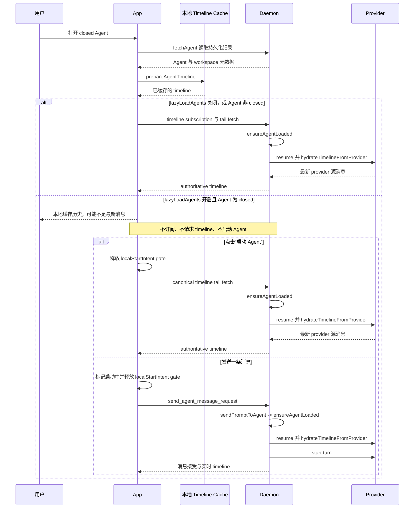

# Agent 懒加载启动 Micro Spec

## 0. 状态与索引

| 字段               | 值                                           |
| ------------------ | -------------------------------------------- |
| task_id            | `0107`                                       |
| spec layer         | `Feature Spec`                               |
| task status        | `已收口`                                     |
| document status    | `Completed`                                  |
| depth              | `standard`                                   |
| phase              | `Review`                                     |
| Execution Approval | `Approved`                                   |
| Approval Source    | `User`                                       |
| file path          | `mydocs/micro_specs/0107_Agent懒加载启动.md` |
| parent spec        | `N/A`                                        |
| superseded by      | `N/A`                                        |
| created / updated  | `2026-09-11`                                 |

## 1. 目标与完成契约

- 当前理解：新增持久化 App 设置 `lazyLoadAgents`，默认关闭。开启后，被动打开的非归档 `closed` Agent 只读取并展示本地 timeline 缓存，始终标注“本地缓存，可能不是最新消息”；不创建 timeline demand、不订阅、不发送 `fetch_agent_timeline_request`，因而不启动 runtime 或同步 provider 源消息
- 核心目标：把 Agent 启动和 provider 历史同步从“打开面板”的隐式副作用改为两个明确用户触发点：点击仅在未启动时显示的“启动 Agent”按钮，或在 Composer 发送一条消息
- Done Contract：设置关闭时现有打开行为不变；设置开启且 Agent 为 `closed` 时缓存态不触发任何远端 timeline 请求；手动启动使用 canonical tail fetch，发送消息继续走既有 `send_agent_message_request` 路径；启动成功后恢复普通面板，失败时保留缓存态和可重试入口

## 2. 范围与事实

- 范围内：App 设置存储与设置页开关；workspace 可见 Agent 的 timeline demand 策略；缓存态面板、明确过期标记与启动按钮；发送消息前释放本地懒加载 gate；定向单测与 Browser E2E
- 范围外：新增或变更 WebSocket 协议、服务端 RPC、provider 实现、持久化 Agent 状态、`refreshAgent()` 语义、已归档 Agent 行为、全量测试、commit、push、发布
- 当前任务单元：仅 App 侧决定何时提出 timeline demand；既有服务端启动和同步语义保持不变
- 轻量评估：`standard`；涉及设置、工作区同步、面板和 Composer 多个 App 模块，但不改变公共协议或服务端数据模型
- 已确认事实：`/h/[serverId]/agent/[agentId]` 的 `fetchAgent()` 只读取持久化 Agent 记录并解析 workspace，不会启动 runtime
- 已确认事实：打开 workspace Agent tab 后，`workspace-screen.tsx` 总是调用 `prepareAgentTimeline()`，随后将 `visibleAgentIds` 交给 `ViewedTimelineSync.replaceVisibleAgentIds()`；后者的 demand 会发起 timeline 请求
- 已确认事实：服务端普通 `fetch_agent_timeline_request` 会调用 `ensureAgentLoaded()`；该加载流程调用 `hydrateTimelineFromProvider()`。因此当前 provider 源消息同步依赖于这条 Agent 加载路径
- 已确认事实：`projectionRequest.kind === "summary"` 虽可能从持久化摘要返回，但未满足条件会回退普通 timeline fetch 并加载 Agent，不能作为懒加载实现
- 已确认事实：`send_agent_message_request` 进入 `sendPromptToAgent()`，后者调用 `ensureAgentLoaded()`；用户确认“发送一条消息”是第二个启动触发点
- 延迟判定：`lazyLoadAgents && !localStartIntent && (!agent || (!agent.archivedAt && (agent.status === "closed" || hasPassiveDeferral)))`。未知 Agent 元数据先等待目录记录，避免被动打开时在状态到达前泄露远端 demand；当前 App 进程首次被动观察到 `closed` 后保留 session-local deferral，只有本地启动或发送意图可以解除，避免晚到目录更新造成被动同步泄露
- 风险与未知：普通 `AgentStreamSection` 含历史翻页、Activity 详情、Outline 跳转和编辑后重同步等远端入口。缓存态必须使用受限渲染路径或显式断开这些回调，不能只隐藏初始 fetch

## 3. 时序图

## 4. 涉及文件与计划

| 文件                                                                                                                                      | 计划变化                                                                                                                          | 事实源                                           |
| ----------------------------------------------------------------------------------------------------------------------------------------- | --------------------------------------------------------------------------------------------------------------------------------- | ------------------------------------------------ |
| `packages/app/src/hooks/use-settings/storage.ts`、对应测试                                                                                | 增加 `lazyLoadAgents` 类型、默认值、持久化 schema 与旧设置缺字段兼容                                                              | 现有 `restoreLastWorkspaceOnLaunch` 模式         |
| `packages/app/src/screens/settings-screen.tsx`、`packages/app/src/i18n/resources/*.ts`                                                    | 在 General 设置中增加开关、说明与所有 locale 文案                                                                                 | 现有开关布局与 i18n 类型契约                     |
| `packages/app/src/screens/workspace/workspace-screen.tsx`、新增相邻策略模块和测试                                                         | 保留所有可见 Agent 的本地 `prepareAgentTimeline()`，但只把不受 gate 约束的 Agent 交给 `ViewedTimelineSync`                        | 当前 `visibleAgentIds` 同时驱动缓存与远端 demand |
| `packages/app/src/panels/agent-panel.tsx`、必要时 `packages/app/src/agent-stream/view.tsx`                                                | 增加缓存态渲染：过期标记、启动按钮和 Composer；禁用会请求远端历史、Activity 详情、Outline、编辑重同步的入口                       | 普通流视图当前含多个远端回调                     |
| `packages/app/src/hooks/use-agent-initialization.ts`、Composer 集成点                                                                     | 手动启动复用 `ensureAgentIsInitialized()` 的 canonical tail fetch；发送前只释放本地 gate，再复用 `dispatchComposerAgentMessage()` | 现有初始化与发送路径                             |
| `packages/app/src/timeline/viewed-timeline-sync.test.ts`、新增策略测试、`packages/app/e2e/browser/lazy-agent-loading.ui-contract.spec.ts` | 覆盖 demand 过滤、无被动请求、启动和发送恢复正常路径                                                                              | timeline owner 与 Browser public seam            |
| `mydocs/micro_specs/0107_*`、`mydocs/todolist.md`                                                                                         | 回写实施、验证和最终状态                                                                                                          | 项目工作流                                       |

1. 按现有 App settings 模式加入默认关闭且向后兼容的 `lazyLoadAgents` 开关与设置页入口
2. 提取可单测的“是否延迟远端 timeline 同步”策略，将本地缓存准备和远端同步需求分离
3. 在 Agent 面板建立受限缓存态：缓存可见、过期提示常显、仅在该态展示“启动 Agent”按钮，且不暴露远端历史操作
4. 点击按钮时调用 `ensureAgentIsInitialized()`；发送时先设置本地启动意图再沿用 `dispatchComposerAgentMessage()`，不新建 RPC 或替换服务端启动逻辑
5. 用纯策略测试和 Browser E2E 证明被动打开零远端请求、两种显式触发恢复实时 timeline，并运行最窄静态检查

## 5. 执行前检查点

- 当前目标：让启用懒加载的 `closed` Agent 在被动打开时只展示可能过期的本地缓存，直到用户明确启动或发送消息
- 当前进度：启动与 provider 同步链路、缓存准备链路、普通流视图的远端入口均已定位；时序图和测试边界已落盘，用户已批准 App 侧实施
- 当前动作是否仍服务核心目标：`是；实现只改变 App 发起 demand 的时机，不改变 daemon/provider 语义`
- 下一步：先为延迟判定和 settings 兼容性写 RED 测试，再实现 App 侧 gate 与缓存态
- 风险与回退：任何缓存态远端请求都违反核心契约；若受限视图无法复用现有流渲染而不泄露请求入口，改用更小的只读缓存投影。回退为关闭该设置或删除 App gate，服务端不受影响
- 验证方式：App 定向 Vitest、目标 Browser E2E、根 `npm run typecheck`、`npm run lint`、受影响文件格式检查和 `git diff --check`
- TDD 判定、测试 seam 与验收行为：`TDD；纯同步策略 + Browser public seam；被动打开不产生 timeline 请求，缓存提示可见，点击启动或发送后才出现 canonical 请求与新 timeline`
- seam 确认：`User；用户明确指定缓存展示、过期标记、手动启动和发送触发四项产品契约`
- Execution Approval / Source：`Approved / User；2026-09-11 用户明确批准按 0107 实施，并要求保持不改协议、不改 server`

## 6. 测试边界清单

| 边界            | 要证明的行为                                                                                                                  | 测试层级                      |
| --------------- | ----------------------------------------------------------------------------------------------------------------------------- | ----------------------------- |
| 设置默认与迁移  | 新安装和缺失旧字段均得到 `lazyLoadAgents: false`；更新后值可持久化                                                            | App 单测                      |
| 可见 Agent 策略 | 设置关闭时保留全量同步；开启后先等待未知 Agent 元数据，并过滤未启动的非归档 `closed` Agent，`idle`、`running`、`error` 不过滤 | 纯策略单测                    |
| 缓存准备        | 受 gate 约束的 Agent 仍调用 `prepareAgentTimeline()` 并渲染已缓存的 painted timeline                                          | 策略/Browser E2E              |
| 被动打开        | 不调用 `fetch_agent_timeline_request`，不发送 summary fallback，不触发 `ensureAgentLoaded()` 或 provider hydrate              | Browser E2E 与 transport 断言 |
| 缓存态 UX       | 始终显示“本地缓存，可能不是最新消息”和“启动 Agent”；无缓存时仍保留说明与启动入口                                              | Browser E2E                   |
| 远端入口封闭    | 缓存态不能触发历史翻页、Activity 详情、Outline 跳转、编辑重同步或其他 timeline fetch                                          | Browser E2E / 回调端口断言    |
| 手动启动        | 点击后只走 canonical tail fetch，不使用 summary 或 `refreshAgent()`；成功后进入普通实时面板                                   | App 单测与 Browser E2E        |
| 发送消息        | Composer 先释放本地 gate，再复用 `dispatchComposerAgentMessage()`；服务端既有 `sendPromptToAgent()` 启动 Agent 并开始 turn    | Browser E2E 与既有发送契约    |
| 错误与状态回退  | 启动失败时缓存保持可见且可重试；Agent 后续再次为 `closed` 时重新受 gate 约束                                                  | App 单测与 Browser E2E        |

| 验收项                     | 命令或步骤                                                                                                                                                                                                                                                                                                      | 结果       | 证据                                                                                                                                                    |
| -------------------------- | --------------------------------------------------------------------------------------------------------------------------------------------------------------------------------------------------------------------------------------------------------------------------------------------------------------- | ---------- | ------------------------------------------------------------------------------------------------------------------------------------------------------- |
| 设置、策略、目录与状态单测 | `npx vitest run src/hooks/use-settings/storage.test.ts src/timeline/lazy-agent-loading.test.ts src/runtime/directory-sync/index.test.ts src/runtime/host-runtime.test.ts src/stores/session-store.test.ts src/utils/agent-directory-sync.test.ts src/hooks/use-agent-initialization.test.ts --bail=1`，App 目录 | 通过       | 7 files、217 tests                                                                                                                                      |
| 缓存态 Browser 合同        | `npx playwright test --project=browser e2e/browser/lazy-agent-loading.ui-contract.spec.ts`，App 目录                                                                                                                                                                                                            | 通过       | 2 passed；真实隔离 daemon，验证被动打开、手动启动、发送消息                                                                                             |
| Lint                       | 根 `npm run lint`                                                                                                                                                                                                                                                                                               | 通过       | 0 warning、0 error                                                                                                                                      |
| Typecheck                  | 根 `npm run typecheck`                                                                                                                                                                                                                                                                                          | 范围外阻塞 | 本次引入的 `agent-stream/view.tsx` 类型错误已修复；仅余用户已有删除 `packages/app/src/terminal/webview/terminal-emulator-webview-html.ts` 引起的 TS2307 |
| 格式与差异                 | 受影响文件 `npm run format:check:files -- <files>`、`git diff --check`                                                                                                                                                                                                                                          | 通过       | 31 个 0107 文件格式检查通过；`git diff --check` 无输出                                                                                                  |
| 边界确认                   | `git diff --name-only -- packages/server packages/protocol`                                                                                                                                                                                                                                                     | 通过       | 无输出，未改协议或 server                                                                                                                               |

- 未验证项与原因：全局 typecheck 受范围外终端文件删除阻塞，未修改或恢复该用户改动；Native 真机手工 smoke 未运行，Browser E2E 覆盖了公开交互合同
- 剩余风险：本地缓存仅能展示已有副本，首次无缓存的 closed Agent 仍只显示提示与启动入口；provider 载入成本和各 provider 的历史读取差异保持既有行为
- Done Contract 是否由证据满足：`是；设置关闭保留既有 demand，开启后被动打开零 timeline request，手动启动和发送消息均由 Browser E2E 证明恢复既有启动路径`

## 7. 执行与变更记录

- 实际改动：新增默认关闭且向后兼容的 `lazyLoadAgents` 设置；分离可见 Agent 的本地 timeline cache 准备与远端 demand；缓存态显示可能过期提示与手动启动按钮；Composer 发送前释放本地 gate；缓存态关闭历史分页、Activity 详情、Outline、fork、编辑及工作区 diff 等远端入口；未知 Agent 元数据先等待目录记录，避免状态到达前泄露远端 demand
- 偏差与用户决策：用户要求编号 `0106`，但该编号已被 `mydocs/micro_specs/0106_修复结束会话最后消息编辑.md` 占用，按项目编号规则分配 `0107`
- Change Log：`2026-09-11` 确认普通 timeline fetch 与发送消息均经 `ensureAgentLoaded()` 和 provider hydrate；实现本地缓存恢复、session-local deferred gate 和所有缓存态远端入口封闭；最终复验定向 Vitest 217/217、Browser 2/2、lint、31 个文件格式检查和 diff 均通过，typecheck 仅余范围外终端 HTML 删除引起的 TS2307

## 8. 恢复与同步

- 状态说明：`已收口；保持 App-only 范围，未改协议或 server`
- 当前卡点：`无功能卡点；根 typecheck 仅受范围外终端文件删除阻塞`
- 下一步唯一动作：`N/A`
- Resume / Handoff：若继续排查全局类型检查，先确认终端 HTML 删除的归属；0107 本身的恢复锚点是被动缓存态不得创建 timeline demand 或使用 summary fallback
- Project Sync Candidates：`无；provider 同步依赖 Agent 加载是本任务实现事实，已保留在 micro-spec`
- 长期文档同步：`N/A`

### 提交记录

| 提交信息（Commit Message）                      | 提交脚注（Commit Footer） | 关联改动或阶段 | 文档同步状态 | 备注     |
| ----------------------------------------------- | ------------------------- | -------------- | ------------ | -------- |
| `feat(agent): lazy-load closed agent timelines` | `N/A`                     | `0107`         | `已同步`     | 本地提交 |
